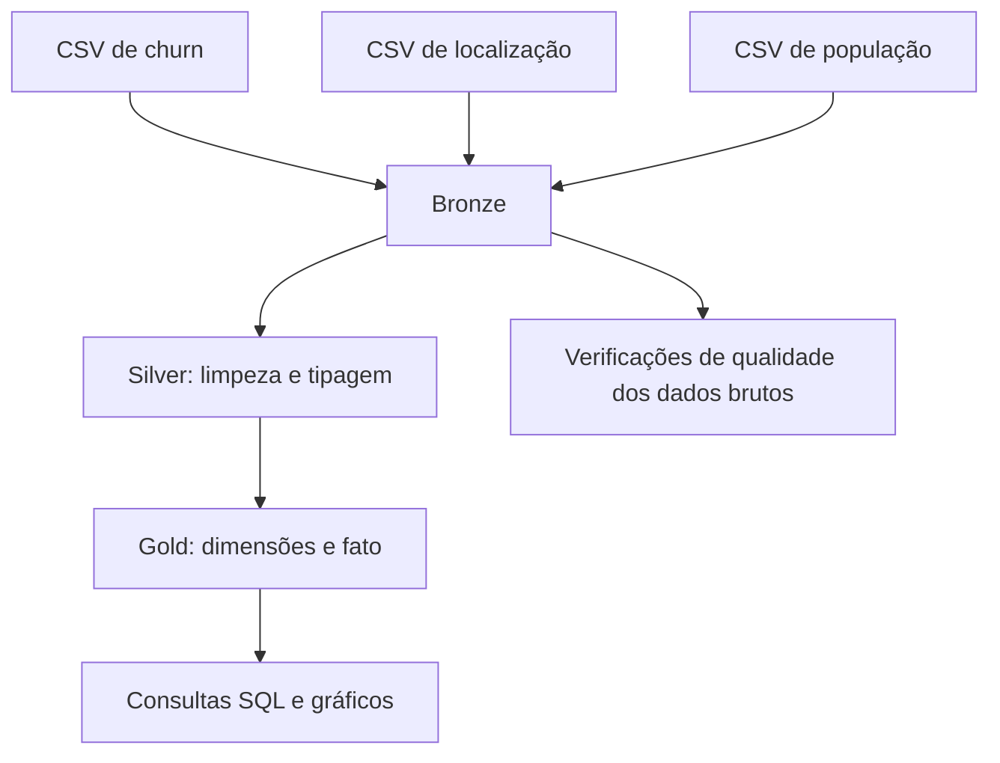
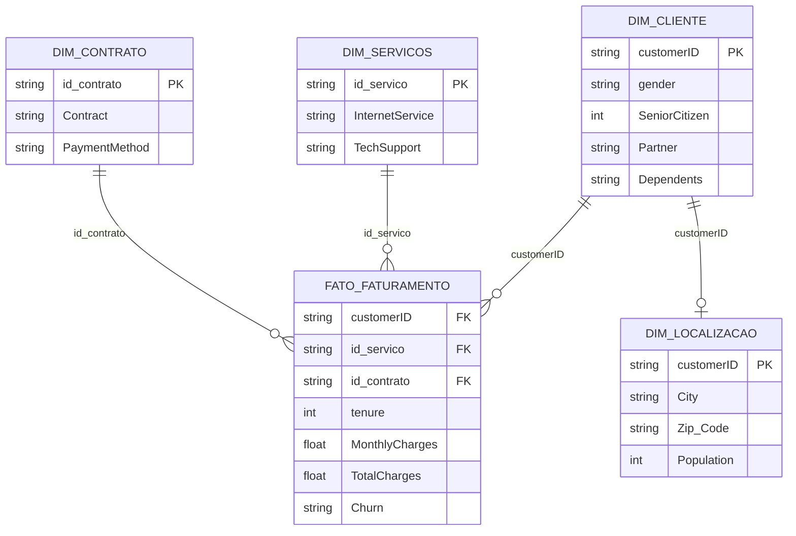

# MVP Engenharia de Dados — Pipeline de Análise de Churn (Telco)

**Pós-graduação em Ciência de Dados e Analytics | PUC-Rio**  
**Disciplina:** Engenharia de Dados  
**Autor:** Hamilton Maia Christovam  
**Tecnologias:** Databricks Free Edition, PySpark, Spark SQL, Delta Lake e Unity Catalog

Usei a mesma base do meu MVP anterior (Machine Learning): o **IBM Telco Customer Churn**. Trabalho na área comercial B2B de uma empresa de telecom, e mesmo essa base sendo de pessoa física, ela traz variáveis bem parecidas com o que vejo no dia a dia — contrato, faturamento, retenção. Neste sprint, enriqueci a base original com dados geográficos e populacionais.

## Objetivo

Entender quais fatores de serviço, contrato e localização mais influenciam o cancelamento (*churn*) e o faturamento dos clientes, para apoiar decisões comerciais de retenção.

### Perguntas de negócio

1. O modelo de contratação (mensal vs. anual/bienal) tem impacto direto na taxa de churn?
2. Clientes de fibra ótica geram faturamento total médio superior aos de outras tecnologias?
3. Serviços adicionais (suporte técnico, segurança online) reduzem o churn?
4. Qual o método de pagamento preferido pelos clientes mais longevos e rentáveis?
5. Existe concentração de churn ou de clientes de alto valor em cidades/faixas de população específicas?
6. O faturamento médio varia conforme a densidade populacional da região do cliente?

## Fontes de dados

Três arquivos CSV, hospedados neste repositório para reprodutibilidade:

- [`WA_Fn-UseC_-Telco-Customer-Churn.csv`](./WA_Fn-UseC_-Telco-Customer-Churn.csv) — base principal (IBM Telco Customer Churn)
- [`Telco_customer_churn_location.csv`](./Telco_customer_churn_location.csv) — localização por cliente (cidade, CEP, lat/long)
- [`Telco_customer_churn_population.csv`](./Telco_customer_churn_population.csv) — população por CEP

Dados criados e disponibilizados pela IBM para fins educacionais — anonimizados, sem restrição de uso acadêmico.

## 3. Arquitetura e processamento

O pipeline foi desenvolvido no **Databricks Free Edition**, com processamento em **PySpark**, consultas em **Spark SQL** e persistência em tabelas **Delta Lake**, organizadas nos esquemas `main.bronze`, `main.silver` e `main.gold`.

### Bronze — ingestão

Os três CSVs são lidos do GitHub com `pandas`, convertidos em DataFrames Spark e persistidos como tabelas Delta. Para viabilizar a gravação, alguns nomes de colunas são normalizados já nessa etapa, como `Zip Code` → `Zip_Code`, `Lat Long` → `Lat_Long` e `Customer ID` → `customerID`. Assim, a Bronze preserva os valores recebidos, mas **não é uma cópia literal dos cabeçalhos originais**.

Tabelas: `main.bronze.telco_churn_raw`, `main.bronze.telco_location_raw` e `main.bronze.telco_population_raw`.

### Silver — limpeza e padronização

A Silver converte `TotalCharges` em valor numérico e trata os 11 registros vazios associados a clientes com `tenure = 0`, atribuindo-lhes `0.0` conforme a regra adotada no projeto. Também remove a formatação textual da população e converte esse campo para inteiro.

Tabelas: `main.silver.telco_churn_cleaned`, `main.silver.telco_location_cleaned` e `main.silver.telco_population_cleaned`.

### Gold — modelagem dimensional

A Gold organiza os dados em quatro dimensões e uma tabela fato. As chaves das dimensões de serviços e contratos são geradas por `MD5` a partir das respectivas combinações de atributos.

A dimensão de localização é relacionada à tabela fato por `customerID` nas consultas analíticas, embora essa chave não seja materializada como uma chave estrangeira declarada no Delta Lake. O diagrama apresenta os atributos centrais, não todas as colunas. O **catálogo de dados**, com atributos, tipos e domínios documentados, está no [`04_Gold.ipynb`](./MVP_Notebooks/04_Gold.ipynb)

## Qualidade de dados

Antes de modelar, verifiquei nulos, domínio de valores, faixa numérica e duplicidade de chave em cada atributo, ainda na camada Bronze. Achados principais: `TotalCharges` tinha 11 registros vazios (clientes com `tenure = 0`); `Population` não dava pra comparar numericamente por causa da formatação de texto; `customerID` e `Zip_Code` confirmados como chaves únicas, sem duplicidade.

## Principais resultados

- Contrato mês a mês cancela muito mais que contratos de 1-2 anos.
- Fibra ótica tem faturamento maior, mas exige mais atenção no pós-venda.
- Suporte técnico está associado a menor churn.
- Pagamento automático (cartão) está associado a mais tempo de casa e mais receita.
- Por Estado não havia variação real (base 100% Califórnia). Troquei para análise por Cidade, filtrando só cidades com pelo menos 30 clientes pra evitar conclusão de amostra pequena.
- Densidade populacional da região também se relaciona com o perfil de consumo e churn.

## Estrutura do projeto

O pipeline foi dividido em um notebook por etapa, seguindo a recomendação da disciplina. Cada notebook grava suas tabelas Delta no Unity Catalog, e o próximo lê essas tabelas — não é preciso reaproveitar nada em memória entre eles.

| Notebook | Conteúdo |
|---|---|
| [`01_Objetivo.ipynb`](./MVP_Notebooks/01_Objetivo.ipynb) | Contexto, problema e perguntas de negócio originais |
| [`02_Coleta_e_Bronze.ipynb`](./MVP_Notebooks/02_Coleta_e_Bronze.ipynb) | Fontes, ingestão e persistência Bronze |
| [`03_Silver.ipynb`](./MVP_Notebooks/03_Silver.ipynb) | Limpeza, conversão de tipos e persistência Silver |
| [`04_Gold.ipynb`](./MVP_Notebooks/04_Gold.ipynb) | Modelagem dimensional, catálogo de dados e persistência Gold |
| [`05_Analise.ipynb`](./MVP_Notebooks/05_Analise.ipynb) | Qualidade, consultas SQL, gráficos e discussão dos resultados |
| [`06_Autoavaliacao.ipynb`](./MVP_Notebooks/06_Autoavaliacao.ipynb) | Desafios, aprendizado, objetivos atingidos e próximos passos |

## Como rodar

1. Crie uma conta no [Databricks Free Edition](https://www.databricks.com/try-databricks).
2. Importe os 6 notebooks deste repositório para o seu workspace.
3. Leia o [`01_Objetivo`](./MVP_Notebooks/01_Objetivo.ipynb), que é documental.
4. Execute, nesta ordem, os notebooks [`02_Coleta_e_Bronze`](./MVP_Notebooks/02_Coleta_e_Bronze.ipynb), [`03_Silver`](./MVP_Notebooks/03_Silver.ipynb), [`04_Gold`](./MVP_Notebooks/04_Gold.ipynb) e [`05_Analise`](./MVP_Notebooks/05_Analise.ipynb).
5. Consulte o [`06_Autoavaliacao`](./MVP_Notebooks/06_Autoavaliacao.ipynb), também documental.

O código utiliza o catálogo `main` e cria os esquemas `bronze`, `silver` e `gold`. A conta utilizada precisa permitir a criação de esquemas e tabelas nesse catálogo; caso contrário, os nomes qualificados devem ser adaptados no código. A ingestão depende de acesso às URLs públicas dos CSVs neste repositório. As tabelas são persistidas em Delta Lake, de modo que os notebooks seguintes leem as tabelas gravadas, sem depender de variáveis mantidas em memória entre execuções.

Os notebooks versionados incluem resultados de execução quando disponíveis. O GitHub permite visualizar essas saídas, mas não executa o código nem necessariamente reproduz recursos interativos do Databricks.

## Autoavaliação

Discussão sobre desafios técnicos, objetivos atingidos e próximos passos está em `06_Autoavaliacao.ipynb`.

