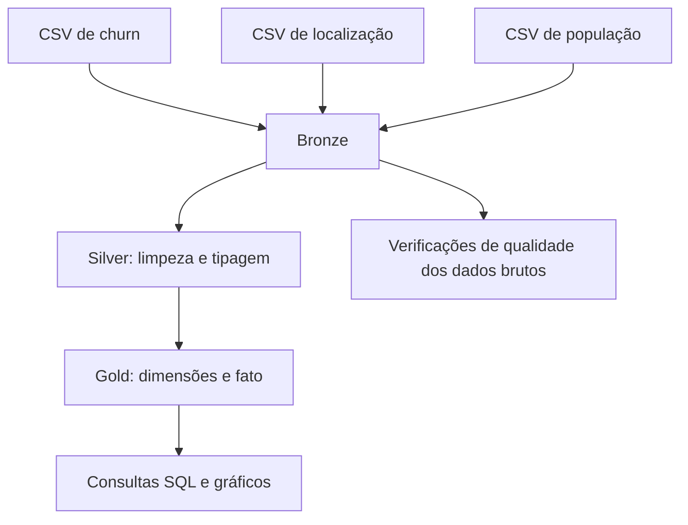
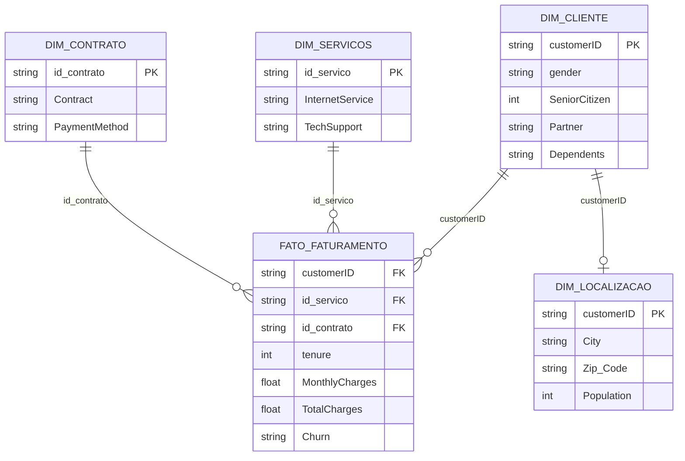

# MVP de Engenharia de Dados — Análise de Churn em Telecomunicações

**Pós-graduação em Ciência de Dados e Analytics | PUC-Rio**  
**Disciplina:** Engenharia de Dados  
**Autor:** Hamilton Maia Christovam  
**Tecnologias:** Databricks Free Edition, PySpark, Spark SQL, Delta Lake e Unity Catalog

## 1. Contexto e objetivo

Este MVP implementa um pipeline de dados em nuvem para integrar, tratar, modelar e analisar informações de clientes de telecomunicações. O projeto utiliza a base **IBM Telco Customer Churn**, também empregada em meu MVP anterior de Machine Learning, agora enriquecida com dados de localização e população por código postal.

Minha experiência na área comercial B2B de telecomunicações motivou a escolha do problema. Embora os dados representem um cenário de clientes residenciais, variáveis como modalidade contratual, serviços contratados, faturamento e cancelamento são relevantes para a discussão de estratégias comerciais e retenção.

O objetivo de Engenharia de Dados é disponibilizar dados confiáveis e organizados em uma arquitetura *Lakehouse*, permitindo investigar associações entre características dos clientes, serviços, contratos, localização, churn e faturamento. As análises são descritivas e **não estabelecem causalidade**.

### Perguntas de negócio originais

As perguntas abaixo são preservadas conforme a definição inicial do projeto. Suas limitações e adaptações analíticas são explicitadas adiante.

1. O modelo de contratação (mensal versus anual/bienal) tem impacto direto na taxa de churn?
2. Clientes de fibra óptica geram faturamento total médio superior aos de outras tecnologias?
3. Serviços adicionais, como suporte técnico e segurança online, reduzem o churn?
4. Qual é o método de pagamento preferido pelos clientes mais longevos e rentáveis?
5. Existe concentração de churn ou de clientes de alto valor em cidades ou faixas de população específicas?
6. O faturamento médio varia conforme a densidade populacional da região do cliente?

**Delimitação:** o conjunto de dados permite comparar grupos e identificar associações, mas não medir impactos causais. Na pergunta 4, o pipeline compara médias de permanência e faturamento por método de pagamento; não mede preferência declarada. Na pergunta 5, a consulta implementada analisa churn por cidade, não concentração de clientes de alto valor por cidade. Na pergunta 6, a base fornece **população por CEP**, e não área territorial; portanto, a análise implementada compara **faixas populacionais**, não densidade populacional propriamente dita. A análise de serviços adicionais implementada concentra-se no suporte técnico.

## 2. Fontes de dados

Os três arquivos utilizados estão incluídos neste repositório, permitindo consultar exatamente os dados empregados na execução do MVP.

| Arquivo | Conteúdo | Papel no pipeline |
|---|---|---|
| [`WA_Fn-UseC_-Telco-Customer-Churn.csv`](./WA_Fn-UseC_-Telco-Customer-Churn.csv) | Dados cadastrais, contratos, serviços, cobranças e churn | Fonte principal |
| [`Telco_customer_churn_location.csv`](./Telco_customer_churn_location.csv) | Localização dos clientes, incluindo cidade, CEP e coordenadas | Enriquecimento geográfico |
| [`Telco_customer_churn_population.csv`](./Telco_customer_churn_population.csv) | População associada aos CEPs | Enriquecimento populacional |

A base principal é conhecida como *IBM Telco Customer Churn*. As três cópias utilizadas pelo pipeline são lidas diretamente deste repositório por meio de URLs `raw` do GitHub. O notebook [`02_Coleta_e_Bronze`](./MVP%20Notebooks/02_Coleta_e_Bronze.ipynb) documenta a estratégia de coleta.

**Fonte e finalidade de uso:** as bases são atribuídas à **IBM** e utilizadas neste MVP como conjuntos de dados disponibilizados para fins educacionais. Segundo a identificação da fonte adotada no projeto, seu uso educacional é livre. As três cópias empregadas no pipeline estão incluídas neste repositório. Essa informação não equivale à confirmação de uma licença específica para redistribuição ou uso comercial; para essas finalidades, devem ser consultados os termos oficiais de cada conjunto de dados.

## 3. Arquitetura e processamento

O pipeline foi desenvolvido no **Databricks Free Edition**, com processamento em **PySpark**, consultas em **Spark SQL** e persistência em tabelas **Delta Lake**, organizadas nos esquemas `main.bronze`, `main.silver` e `main.gold`.

### Bronze — ingestão

Os três CSVs são lidos do GitHub com `pandas`, convertidos em DataFrames Spark e persistidos como tabelas Delta. Para viabilizar a gravação, alguns nomes de colunas são normalizados já nessa etapa, como `Zip Code` → `Zip_Code`, `Lat Long` → `Lat_Long` e `Customer ID` → `customerID`. Assim, a Bronze preserva os valores recebidos, mas **não é uma cópia literal dos cabeçalhos originais**.

Tabelas: `main.bronze.telco_churn_raw`, `main.bronze.telco_location_raw` e `main.bronze.telco_population_raw`.

### Silver — limpeza e padronização

A Silver converte `TotalCharges` em valor numérico e trata os 11 registros vazios associados a clientes com `tenure = 0`, atribuindo-lhes `0.0` conforme a regra adotada no projeto. Também remove a formatação textual da população e converte esse campo para inteiro.

Tabelas: `main.silver.telco_churn_cleaned`, `main.silver.telco_location_cleaned` e `main.silver.telco_population_cleaned`.

### Gold — modelagem dimensional

A Gold organiza os dados em quatro dimensões e uma tabela fato. As chaves das dimensões de serviços e contratos são geradas por `MD5` a partir das respectivas combinações de atributos.

A dimensão de localização é relacionada à tabela fato por `customerID` nas consultas analíticas, embora essa chave não seja materializada como uma chave estrangeira declarada no Delta Lake. O diagrama apresenta os atributos centrais, não todas as colunas. O **catálogo de dados**, com atributos, tipos e domínios documentados, está no [`04_Gold.ipynb`](./MVP%20Notebooks/04_Gold.ipynb).

## 4. Qualidade dos dados

O notebook de análise examina as três fontes ainda na Bronze, incluindo valores nulos ou vazios, domínios categóricos, intervalos numéricos e duplicidade de identificadores.

Entre os achados documentados estão os **11 valores vazios em `TotalCharges`**, todos associados a clientes com `tenure = 0`, e a necessidade de converter a coluna `Population`, originalmente representada como texto com separadores de milhar. A padronização das chaves permite integrar as fontes de churn, localização e população.

As verificações, consultas e saídas salvas estão em [`05_Analise.ipynb`](./MVP%20Notebooks/05_Analise.ipynb).

## 5. Análises e resultados

As consultas SQL utilizam as tabelas Gold e respondem às perguntas iniciais na extensão permitida pelas variáveis disponíveis.

| Tema | Resultado ou abordagem documentada | Limitação de interpretação |
|---|---|---|
| Modalidade contratual | Contratos mensais apresentam taxa de churn superior à dos contratos de um ou dois anos. | Associação, não efeito causal do contrato. |
| Tecnologia de internet | O grupo de fibra óptica apresenta faturamento total médio superior ao dos demais grupos. | `TotalCharges` é acumulado e depende também do tempo de permanência. |
| Serviços adicionais | Clientes com suporte técnico apresentam menor taxa de churn. | A consulta não isola o efeito do serviço nem analisa separadamente a segurança online. |
| Pagamento | Comparação de permanência média e faturamento total médio por método de pagamento. | Médias observadas não representam preferência declarada ou rentabilidade líquida. |
| Localização | Comparação de churn por cidade, considerando apenas cidades com pelo menos 30 clientes. | O recorte não mede clientes de alto valor por cidade. |
| População | Comparação de faturamento mensal médio e churn entre faixas de população do CEP. | População absoluta não equivale à densidade populacional. |

Os resultados detalhados, as tabelas e os gráficos estão no [`05_Analise.ipynb`](./MVP%20Notebooks/05_Analise.ipynb). A base geográfica utilizada contempla clientes da Califórnia; por isso, a análise territorial foi concentrada em cidades, em vez de comparar estados.

## 6. Estrutura do repositório

| Arquivo | Finalidade |
|---|---|
| [`01_Objetivo.ipynb`](./MVP%20Notebooks/01_Objetivo.ipynb) | Contexto, problema e perguntas de negócio originais |
| [`02_Coleta_e_Bronze.ipynb`](./MVP%20Notebooks/02_Coleta_e_Bronze.ipynb) | Fontes, ingestão e persistência Bronze |
| [`03_Silver.ipynb`](./MVP%20Notebooks/03_Silver.ipynb) | Limpeza, conversão de tipos e persistência Silver |
| [`04_Gold.ipynb`](./MVP%20Notebooks/04_Gold.ipynb) | Modelagem dimensional, catálogo de dados e persistência Gold |
| [`05_Analise.ipynb`](./MVP%20Notebooks/05_Analise.ipynb) | Qualidade, consultas SQL, gráficos e discussão dos resultados |
| [`06_Autoavaliacao.ipynb`](./MVP%20Notebooks/06_Autoavaliacao.ipynb) | Desafios, aprendizado, objetivos atingidos e próximos passos |
| [`.databricks/commit_outputs`](./.databricks/commit_outputs) | Configuração de inclusão dos resultados dos notebooks nos commits |

## 7. Como reproduzir

1. Acesse o [Databricks Free Edition](https://www.databricks.com/try-databricks) e importe ou clone este repositório.
2. Leia o [`01_Objetivo`](./MVP%20Notebooks/01_Objetivo.ipynb), que é documental.
3. Execute, nesta ordem, os notebooks [`02_Coleta_e_Bronze`](./MVP%20Notebooks/02_Coleta_e_Bronze.ipynb), [`03_Silver`](./MVP%20Notebooks/03_Silver.ipynb), [`04_Gold`](./MVP%20Notebooks/04_Gold.ipynb) e [`05_Analise`](./MVP%20Notebooks/05_Analise.ipynb).
4. Consulte o [`06_Autoavaliacao`](./MVP%20Notebooks/06_Autoavaliacao.ipynb), também documental.

O código utiliza o catálogo `main` e cria os esquemas `bronze`, `silver` e `gold`. A conta utilizada precisa permitir a criação de esquemas e tabelas nesse catálogo; caso contrário, os nomes qualificados devem ser adaptados no código. A ingestão depende de acesso às URLs públicas dos CSVs neste repositório. As tabelas são persistidas em Delta Lake, de modo que os notebooks seguintes leem as tabelas gravadas, sem depender de variáveis mantidas em memória entre execuções.

Os notebooks versionados incluem resultados de execução quando disponíveis. O GitHub permite visualizar essas saídas, mas não executa o código nem necessariamente reproduz recursos interativos do Databricks.

## 8. Autoavaliação e limitações

A [`autoavaliação`](./MVP%20Notebooks/06_Autoavaliacao.ipynb) registra os desafios encontrados na ingestão, na normalização dos esquemas e na integração de múltiplas fontes, além dos aprendizados com a arquitetura Medalhão e o modelo dimensional.

As principais limitações analíticas são a natureza observacional da base, a ausência de área territorial para calcular densidade populacional, a concentração geográfica na Califórnia e o fato de algumas perguntas originais terem sido respondidas parcialmente. Essas limitações são mantidas de forma explícita para distinguir o objetivo inicialmente proposto das análises efetivamente implementadas.

## 9. Referências e materiais

- [Databricks Free Edition](https://www.databricks.com/try-databricks) — plataforma utilizada no desenvolvimento.
- [Documentação oficial do Databricks](https://docs.databricks.com/) — documentação técnica da plataforma.
- [Apache Spark — documentação oficial](https://spark.apache.org/docs/latest/) — referência para PySpark e Spark SQL.
- [Delta Lake — documentação oficial](https://docs.delta.io/) — referência para o formato de armazenamento.
- **IBM — Telco Customer Churn e bases complementares:** conjuntos de dados atribuídos à IBM e empregados para fins educacionais. Os três arquivos utilizados estão disponíveis na seção [Fontes de dados](#2-fontes-de-dados). A licença específica de redistribuição e uso comercial não foi verificada neste README.

