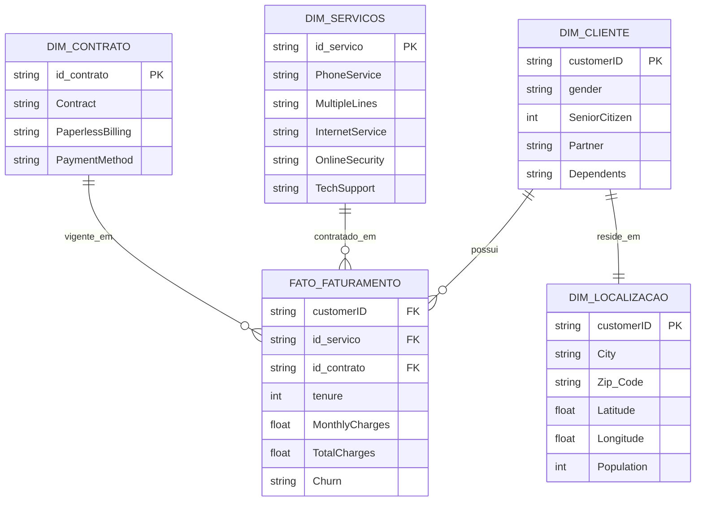

# MVP-Engenharia-de-dados
Repositorio para hospedagem do meu MVP para o sprint de Engenharia de dados - PUCRIO

```mermaid
erDiagram
  DIM_CLIENTE ||--o{ FATO_FATURAMENTO : possui
  DIM_SERVICOS ||--o{ FATO_FATURAMENTO : contratado_em
  DIM_CONTRATO ||--o{ FATO_FATURAMENTO : vigente_em
  DIM_CLIENTE ||--|| DIM_LOCALIZACAO : reside_em

  DIM_CLIENTE {
    string customerID PK
    string gender
    int SeniorCitizen
    string Partner
    string Dependents
  }
  DIM_SERVICOS {
    string id_servico PK
    string PhoneService
    string MultipleLines
    string InternetService
    string OnlineSecurity
    string TechSupport
  }
  DIM_CONTRATO {
    string id_contrato PK
    string Contract
    string PaperlessBilling
    string PaymentMethod
  }
  DIM_LOCALIZACAO {
    string customerID PK
    string City
    string Zip_Code
    float Latitude
    float Longitude
    int Population
  }
  FATO_FATURAMENTO {
    string customerID FK
    string id_servico FK
    string id_contrato FK
    int tenure
    float MonthlyCharges
    float TotalCharges
    string Churn
  }
```
