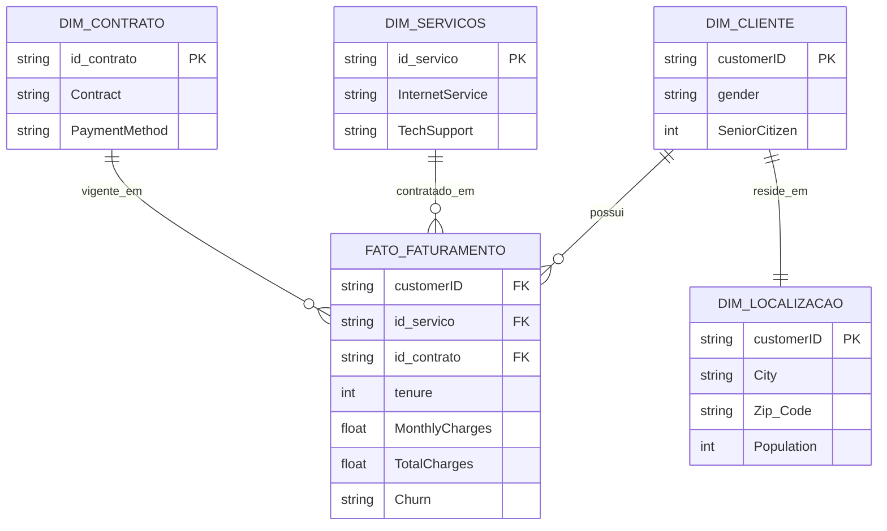

# MVP Engenharia de Dados — Pipeline de Análise de Churn (Telco)

MVP da pós-graduação em Ciência de Dados e Analytics (PUC-Rio), disciplina de Engenharia de Dados.

Usei a mesma base do meu MVP anterior (Machine Learning): o **IBM Telco Customer Churn**. Trabalho na área comercial B2B de uma empresa de telecom, e mesmo essa base sendo de pessoa física, ela traz variáveis bem parecidas com o que vejo no dia a dia — contrato, faturamento, retenção. Neste sprint, enriqueci a base original com dados geográficos e populacionais.

## Objetivo

Entender quais fatores de serviço, contrato e localização mais influenciam o cancelamento (*churn*) e o faturamento dos clientes, para apoiar decisões comerciais de retenção.

### Perguntas de negócio

1. O modelo de contratação (mensal vs. anual/bienal) tem impacto direto na taxa de churn?
2. Clientes de fibra ótica geram faturamento total médio superior aos de outras tecnologias?
3. Serviços adicionais (suporte técnico, segurança online) reduzem o churn?
4. Qual o método de pagamento preferido pelos clientes mais longevos e rentáveis?
5. Existe concentração de churn ou de clientes de alto valor em cidades/faixas de população específicas?
6. O faturamento médio varia conforme a densidade populacional da região do cliente?

## Fontes de dados

Três arquivos CSV, hospedados neste repositório para reprodutibilidade:

- [`WA_Fn-UseC_-Telco-Customer-Churn.csv`](./WA_Fn-UseC_-Telco-Customer-Churn.csv) — base principal (IBM Telco Customer Churn)
- [`Telco_customer_churn_location.csv`](./Telco_customer_churn_location.csv) — localização por cliente (cidade, CEP, lat/long)
- [`Telco_customer_churn_population.csv`](./Telco_customer_churn_population.csv) — população por CEP

Dados criados e disponibilizados pela IBM para fins educacionais — anonimizados, sem restrição de uso acadêmico.

## Arquitetura

Pipeline em Arquitetura Medalhão, no **Databricks Free Edition**, usando PySpark e Delta Lake:

- **Bronze:** ingestão dos 3 CSVs direto das URLs raw do GitHub. Como o Delta Lake não aceita espaço em nome de coluna, já normalizei `Zip Code` → `Zip_Code` e `Customer ID` → `Customer_ID` nessa etapa.
- **Silver:** limpeza e tipagem — tratei o `TotalCharges` vazio (clientes novos) e o `Population` (vinha como texto com vírgula de milhar, ex. `"54,492"`).
- **Gold:** modelagem em Esquema Estrela, pronta para consulta analítica.

## Modelo de dados

Catálogo de dados completo (todas as colunas, tipos e domínios) está em `04_Gold.ipynb`.

## Qualidade de dados

Antes de modelar, checei nulos, domínio de valores, faixa numérica e duplicidade de chave em cada atributo, ainda na camada Bronze. Achados principais: `TotalCharges` tinha 11 registros vazios (clientes com `tenure = 0`); `Population` não dava pra comparar numericamente por causa da formatação de texto; `customerID` e `Zip_Code` confirmados como chaves únicas, sem duplicidade.

## Principais resultados

- Contrato mês a mês cancela muito mais que contratos de 1-2 anos.
- Fibra ótica tem faturamento maior, mas exige mais atenção no pós-venda.
- Suporte técnico está associado a menor churn.
- Pagamento automático (cartão) está associado a mais tempo de casa e mais receita.
- Por Estado não havia variação real (base 100% Califórnia) — troquei para análise por Cidade, filtrando só cidades com pelo menos 30 clientes pra evitar conclusão de amostra pequena.
- Densidade populacional da região também se relaciona com o perfil de consumo e churn.

## Estrutura do projeto

O pipeline foi dividido em um notebook por etapa, seguindo a recomendação da disciplina. Cada notebook grava suas tabelas Delta no Unity Catalog, e o próximo lê essas tabelas — não é preciso reaproveitar nada em memória entre eles.

| Notebook | Conteúdo |
|---|---|
| `01_Objetivo.ipynb` | Problema a ser resolvido e as 6 perguntas de negócio |
| `02_Coleta_e_Bronze.ipynb` | Fonte, licença dos dados e ingestão bruta (camada Bronze) |
| `03_Silver.ipynb` | Limpeza e padronização dos dados (camada Silver) |
| `04_Gold.ipynb` | Catálogo de dados e modelagem em Esquema Estrela (camada Gold) |
| `05_Analise.ipynb` | Qualidade de dados, consultas SQL, gráficos e discussão dos resultados |
| `06_Autoavaliacao.ipynb` | Desafios técnicos, objetivos atingidos e próximos passos |

## Como rodar

1. Crie uma conta no [Databricks Free Edition](https://www.databricks.com/try-databricks).
2. Importe os 6 notebooks deste repositório para o seu workspace.
3. Execute na ordem numérica, do `01_Objetivo` ao `06_Autoavaliacao` — cada notebook depende das tabelas gravadas pelo anterior, então pular a ordem quebra a execução.

## Autoavaliação

Discussão sobre desafios técnicos, objetivos atingidos e próximos passos está em `06_Autoavaliacao.ipynb`.

## Autor

Hamilton — MVP de pós-graduação em Ciência de Dados e Analytics, PUC-Rio.
